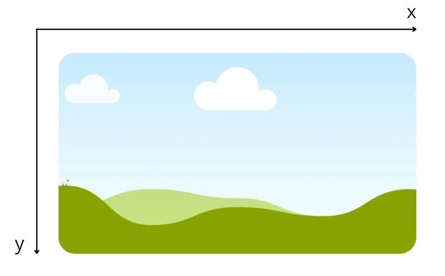

# Урок

### Что такое OpenCV?

Библиотека компьютерного зрения (*computer vision*) и машинного обучения с открытым исходным кодом. В неё входят более 2500 алгоритмов, в которых есть как классические, так и современные алгоритмы для компьютерного зрения и машинного обучения. Эта библиотека имеет интерфейсы на различных языках, среди которых есть *Python*, *Java, C++ и Matlab*.

### 1 Подготовка к работе

1. Для работы нам пригодятся библиотеки *cv2*, устанавливаем её с помощью терминала.
2. Для работы необходимо установить интерпритатор *python* и стандартный текстовый редактор. Для этого зайдем на [оффициальный сайт](https://www.python.org/) и скачаем любую версию *python* (в уроке будет использоваться версия *Python 3.9.5*)
3. После установки мы смлжем использовать встроенный текстовый редактор *IDLE,* вы можете также использовать более продвинутые текстовые редакторы и *IDE,* например: PyCharm, Atom, Notepad ++, Sublime text.
4. В редакторе *IDLE* создаем новый файл и сохраняем его.
5. 
Команда для установки библиотек.
```bash
python -m pip install opencv-python
```

### 2 Получение видеоряда

1. В первую очередь импортируем библиотеку *cv2* ****
2. Для захвата изображения с веб камеры необходимо создать экземпляр класса *VideoCapture* ****библиотеки *cv2*  ****указываем аргумент номер камеры (-1 любая, 1 - для ноутбука встроеная)**.** 
3. Далее мы будем работать в бесконечном цикле, так как видео ряд нужно считывать непрерывно.
4. Вызываемый метод read() объекта cam возвращает *ret (boolean)* - показывает прочитан ли кадр корректно, *frame* - кадр с камеры.
5. Для демонстрации кадра с камеры вызываем метод *imshow*, аргументы: имя окна, и кадр. 
6. Для того, чтобы была возмодность закрыть окно в цикле мы отслеживаем нажатие клавишы "q" на клавиатуре. И при нажатии мы выходим из цикла с помощью *break*
7. После выхода из цикла нужно закрыть окно с помощью функции *destroyAllWindows* **** и прекратить соединение с камерой методом *release* ****у объекта *cam***.** Если соединение с камерой не прекратить, её возможно нельзя будет использовать пока работают процессы *python.exe* и дочерние*.*
8. Код с подробными комментариями находится в файле *main.py*

### 3 Анализ точки (пикселя) по координатам

1. Для начала возьмем код с получением видеоряда, который мы написали ранее.
2. Добавим новую переменную *coordinates*, это кортеж с координатами точки X и Y.
3. Координатные прямые на кадре распологаются таким образом.
4. Теперь нарисуем на кадре прямоугольник, чтобы пометить положение точки, которая нас интересует. Это можно сделать методом *rectangle*, он принимает аргументы: кадр, стартовые координаты, конечные координаты, цвет (BGR), ширину линии.
5. Теперь выведем в консоль цвет нужного пикселя. Переменная frame является двумерным массивом numpy, мы можем получить цвет, указав координыт точек в качестве индексов. (С начала указываем Y, затем X)
6. Цвет - это одномерный массив с 3 числами (BGR) от 0 до 255, где 0 - это минимальное значение.
7. Код с подробными комментариями находится в файле *pixel.py*



Расположение координатных прямых на кадре


Крайние точки прямоугольника

### 4 Детектирование линии

1. Для того, чтобы определить середину линии необходимо перевести видеоряд в черно-белый. Сначала используем метод cvtColor, он принимает аргументы: кадр и метод изменения. Возвращает преобразованный кадр.  (В нашем случае оттенки серого)
2. Для перевода картинки в черно-белую используем метод threshold, аргументы: кадр, пороговое значение, выходящее значение (итоговое), метод изменения.
3. Далее с помощью срезов достанем нижнюю строчку изображения.
4. В цикле мы будем идти с левой стороны кадра, пока не встретим черную линию, тогда запоминаем стартовое значение, заходим во второй цикл и меняем конечное значение.
Когда встретим конец черной линии или кадра, то выходим из цикла.
5. Далее находим среднее значение (середину линии).
6. Рассчитываем координты квадрата.
7. Строим квадрат по примеру из прошлого этапа.
8. Код с подробными комментариями находится в файле *line.py*

### 5 Распознование знаков

Распознование знаков осуществляется по примитивной технологии попиксельного сравнивания. Код с подробными комментариями находится в файле *road_sign.py.* Для тестирования в одной дирректории с файлом должны лежать файлы *man.png* и *right.png.*
